# xsql

## 编译条件
### 1. 需要安装boost库
一个跨平台的c++文件操作库
### 2. 最低c++标准c++20
对于g++编译器，只有g++-10以上版本才支持 std c++20
Ubuntu 20.04默认g++版本为g++-9，可以使用`apt --no-install-recommends install g++-10`安装g++-10

Ubuntu 21.04默认g++版本为g++-10

Ubuntu 21.10默认g++版本为g++-11

对于clang编译器，clang-13指定c++版本为stdc++2b可以编译，其它版本没有试过

MSVC指定`c++语言标准`为`c++latest`
### 3. 建议编译选项(适用于g++编译器)
编译：`-std=c++23 -g0 -O3 -Wall -Wextra -Wno-pedantic -Wno-missing-field-initializers`，在windows下必须还要加一条`-D__xsql_windows_`

链接：Linux下：`-lboost_filesystem`，Msys2：`-lboost_filesystem-mt`
## 具体编译示例
### 1. Ubuntu 20.04
```bash
# 安装依赖
sudo apt --no-install-recommends install libboost-filesystem-dev libboost-dev git g++-10

# 获取源码
git clone git@github.com:xtsql/xsql.git
cd xsql

# 编译release
g++-10 main.cpp xsql_*.cpp compile/xsql_*.cpp -Icompile -I. -lboost_filesystem -std=c++20 -g0 -O3 -Wall -Wextra -pedantic -static

# 编译demo
g++-10 demo.cpp xsql_*.cpp compile/xsql_*.cpp -Icompile -I. -lboost_filesystem -std=c++20 -g0 -O3 -Wall -Wextra -pedantic -static
```
### 2. Debian 11
```bash
# 安装依赖
sudo apt --no-install-recommends install libboost-filesystem-dev libboost-dev git g++

# 获取源码
git clone git@github.com:xtsql/xsql.git
cd xsql

# 编译release
g++ main.cpp xsql_*.cpp compile/xsql_*.cpp -Icompile -I. -lboost_filesystem -std=c++20 -g0 -O3 -Wall -Wextra -pedantic -static

# 编译demo
g++ demo.cpp xsql_*.cpp compile/xsql_*.cpp -Icompile -I. -lboost_filesystem -std=c++20 -g0 -O3 -Wall -Wextra -pedantic -static
```
### 3. Ubuntu 21.04
```bash
# 安装依赖
sudo apt --no-install-recommends install libboost-filesystem-dev libboost-dev git g++-11

# 获取源码
git clone git@github.com:xtsql/xsql.git
cd xsql

# 编译release
g++-11 main.cpp xsql_*.cpp compile/xsql_*.cpp -Icompile -I. -lboost_filesystem -std=c++23 -g0 -O3 -Wall -Wextra -pedantic -static

# 编译demo
g++-11 demo.cpp xsql_*.cpp compile/xsql_*.cpp -Icompile -I. -lboost_filesystem -std=c++23 -g0 -O3 -Wall -Wextra -pedantic -static
```
### 4. Ubuntu 21.10+
```bash
# 安装依赖
sudo apt --no-install-recommends install libboost-filesystem-dev libboost-dev git g++

# 获取源码
git clone git@github.com:xtsql/xsql.git
cd xsql

# 编译release
g++ main.cpp xsql_*.cpp compile/xsql_*.cpp -Icompile -I. -lboost_filesystem -std=c++23 -g0 -O3 -Wall -Wextra -pedantic -static

# 编译demo
g++ demo.cpp xsql_*.cpp compile/xsql_*.cpp -Icompile -I. -lboost_filesystem -std=c++23 -g0 -O3 -Wall -Wextra -pedantic -static
```
### 5. Windows: Msys2
#### 5.1 安装 Msys2
https://www.msys2.org/
#### 5.2 运行Msys2 UCRT 64位版本
在开始菜单里面找到`Msys2 UCRT 64`

<div>
    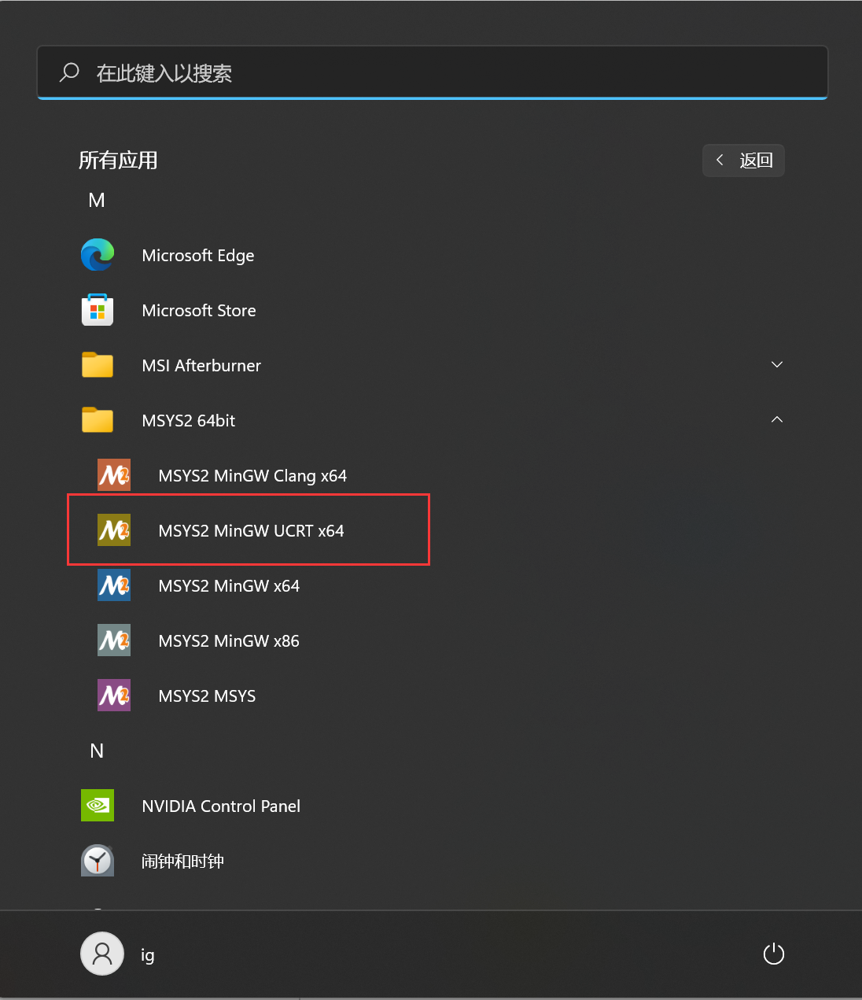
</div>

#### 5.3 升级软件包
```bash
pacman -Syu
```
如果软件自动关闭，请再次打开运行

如果速度很慢可以更换国内镜像源
#### 5.4 安装依赖
```bash
pacman -S --needed ucrt64/mingw-w64-ucrt-x86_64-gcc ucrt64/mingw-w64-ucrt-x86_64-boost msys/git msys/winpty
```
#### 5.5 获取源码
```bash
git clone git@github.com:xtsql/xsql.git
cd xsql
````
#### 5.6 编译
```bash
# 编译release
g++ main.cpp xsql_*.cpp compile/xsql_*.cpp -Icompile -I. -lboost_filesystem-mt -D__xsql_windows_ -fdiagnostics-color=always -fexec-charset=gbk -std=c++23 -g0 -O3 -Wall -Wextra -pedantic -static

# 编译demo
g++ demo.cpp xsql_*.cpp compile/xsql_*.cpp -Icompile -I. -lboost_filesystem-mt -D__xsql_windows_ -fdiagnostics-color=always -fexec-charset=gbk -std=c++23 -g0 -O3 -Wall -Wextra -pedantic -static
```
#### 5.7 运行
```bash
winpty ./a
```
### 6. Windows: Visual Studio(使用自带的MSVC编译器)
以`Visual Studio 2022`为例：
#### 6.1 下载xsql源代，解压
#### 6.2 将源代码转成unicode模式
对每一个源码文件，记事本打开，另存为，选择编码格式为`UTF-16 LE`，覆盖原文件保存：

<div>
    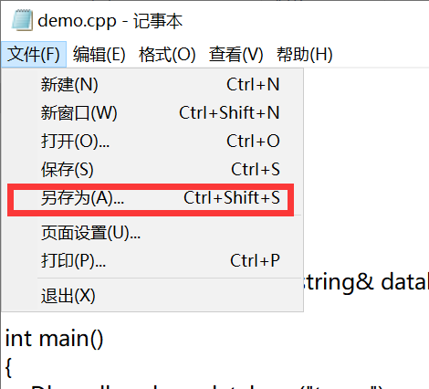
</div>

======

<div>
    
</div>

#### 6.3 下载boost库，安装
boost下载网址： https://www.boost.org/users/download/ ，选择下载 `Prebuilt windows binaries.`

<div>
    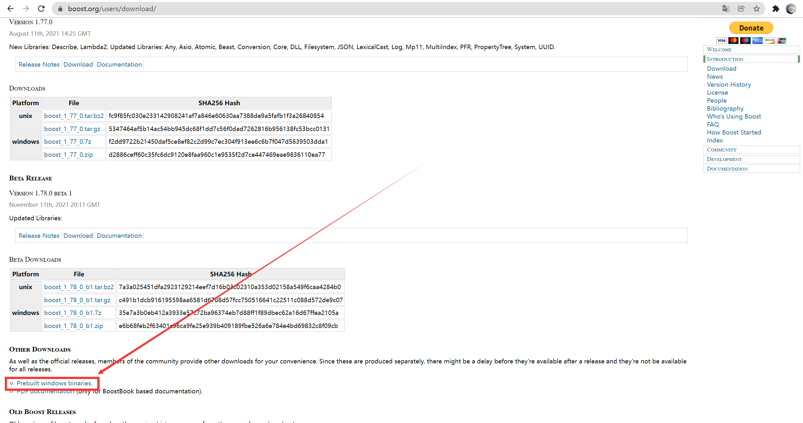
</div>

下载对应你MSVC版本的包
#### 6.4 打开 Visual Studio 新建 c++空项目

<div>
    
</div>

#### 6.5 添加xsql源文件

<div>
    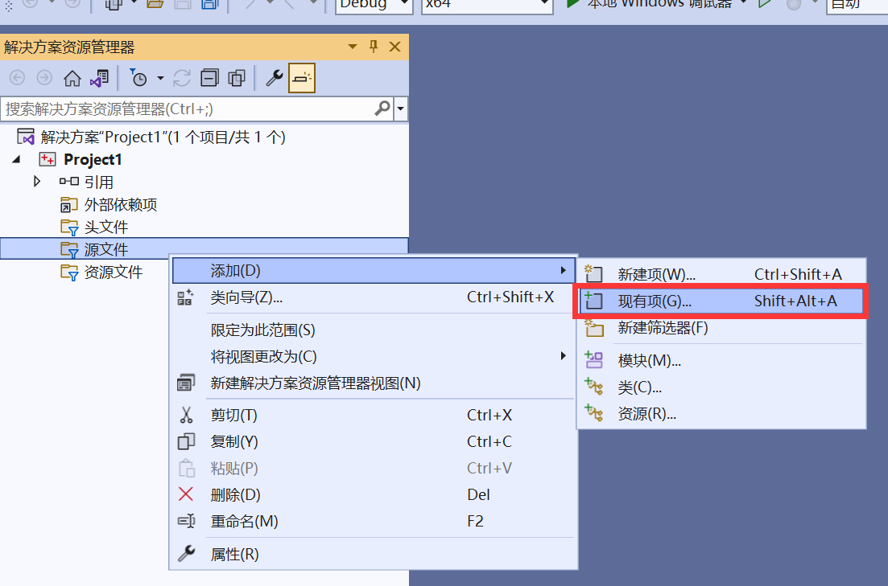
</div>

选择`xsql*.cpp`、`xsql*.hpp`、`compile/xsql*.cpp`、`compile/xsql*.hpp`，以及`main.cpp` 和 `demo.cpp` 选择其中一个

<div>
    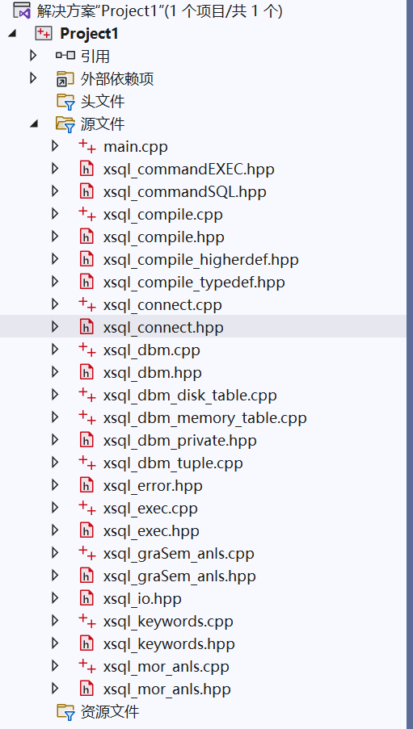
</div>

#### 6.6 项目右键属性

<div>
    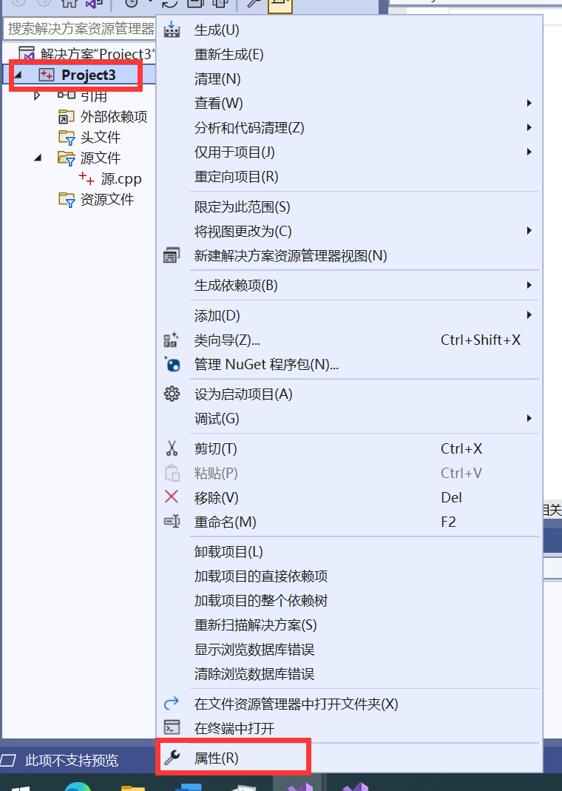
</div>

#### 6.7 添加boost库

<div>
    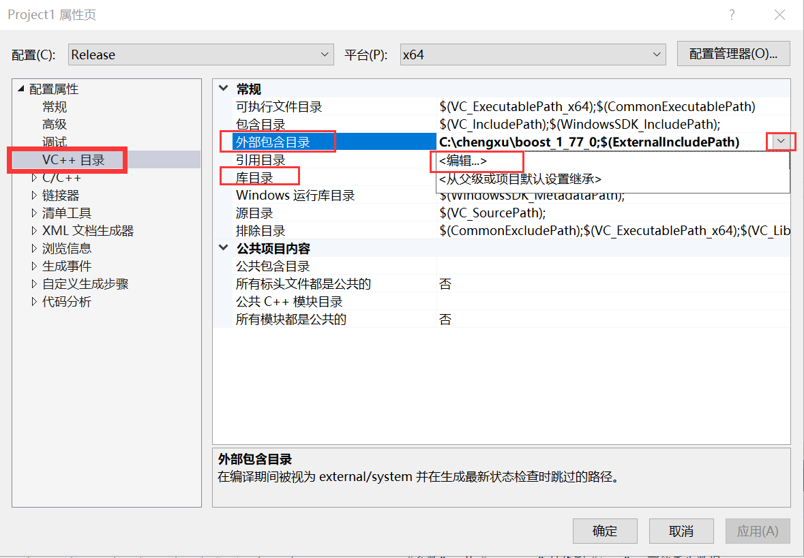
</div>

======

<div>
    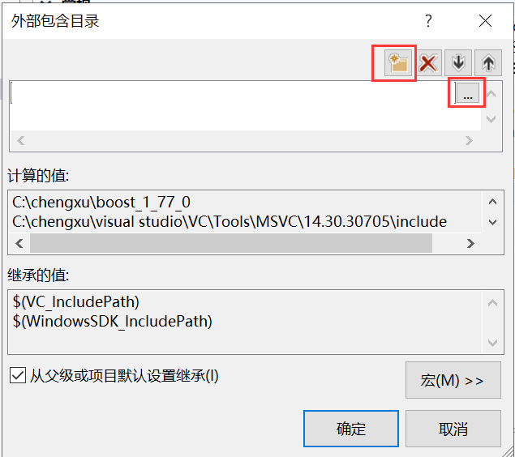
</div>

引用目录添加boost安装的目录

库目录添加boost安装目录下的`lib64xxx`文件夹

<div>
    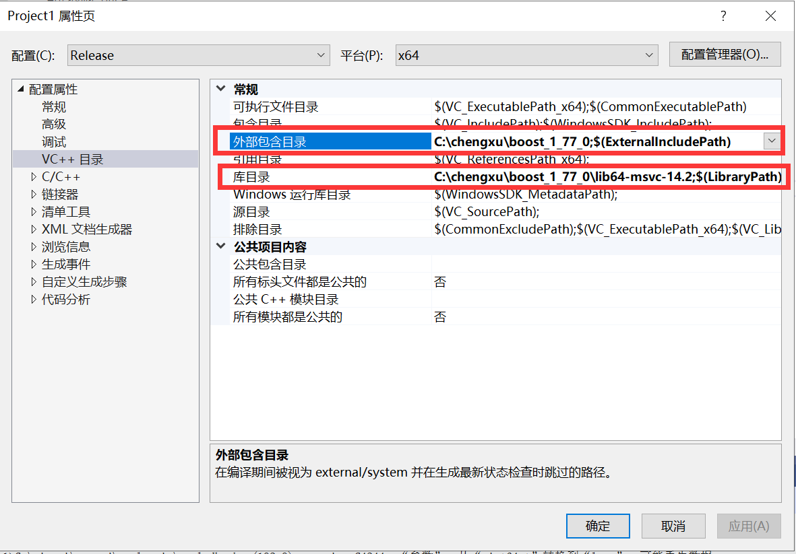
</div>

#### 6.8 设置c++标准和宏定义

<div>
    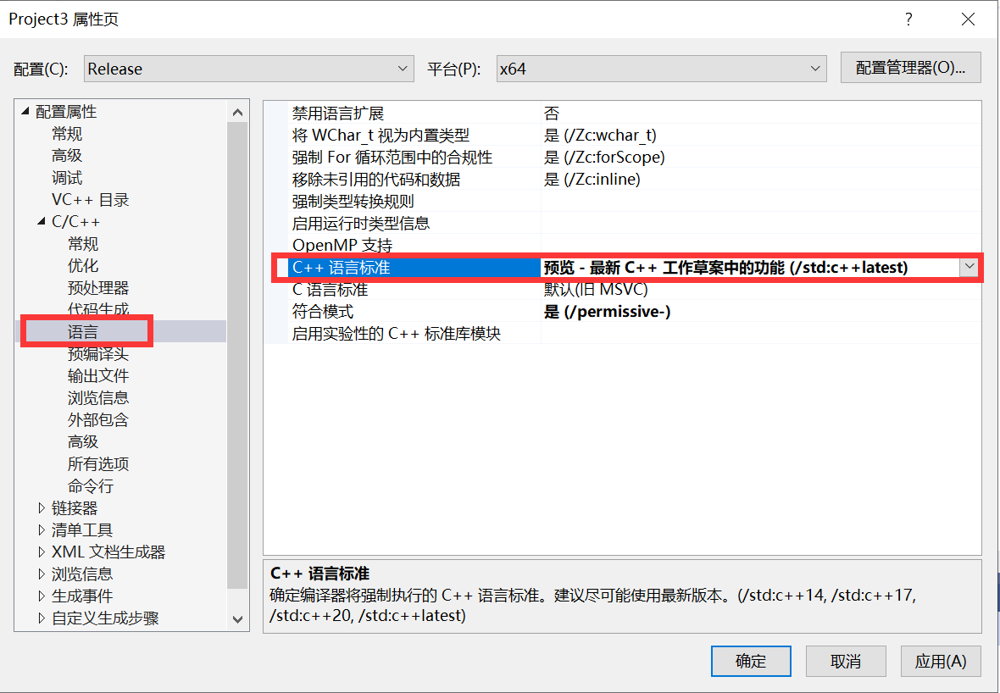
</div>

======

<div>
    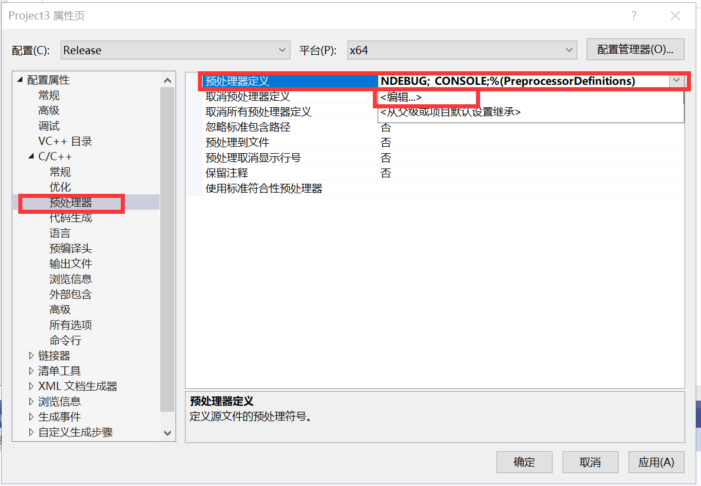
</div>

添加`__xsql_windows_`

<div>
    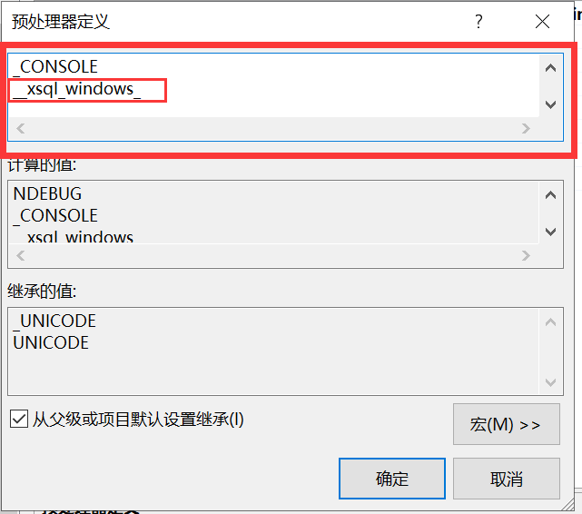
</div>

#### 6.8 编译运行

<div>
    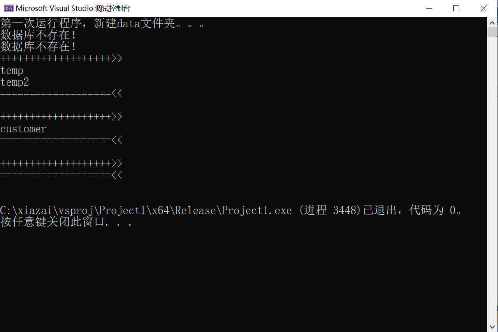
</div>

## 文件说明
main.cpp：提供给用户的程序

demo.cpp：我们开发测试用的示例
